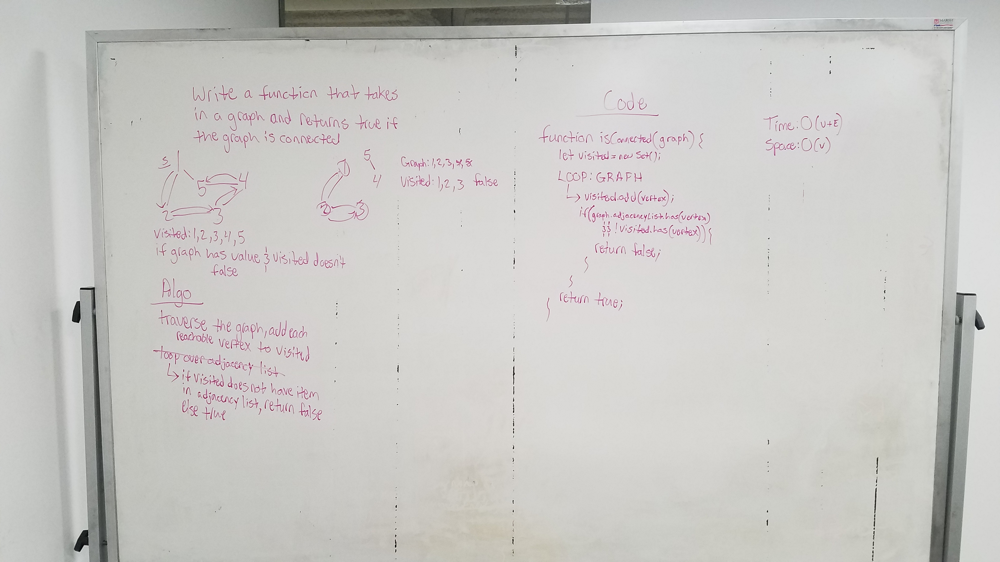

# Is Graph Connected 

Write a function that returns true if the graph is connected and false if not

## Running the tests

I currently have no tests, I have not yet been able to get the function to work. I will continue to work on this into the weekend so that I can get it up and running.

